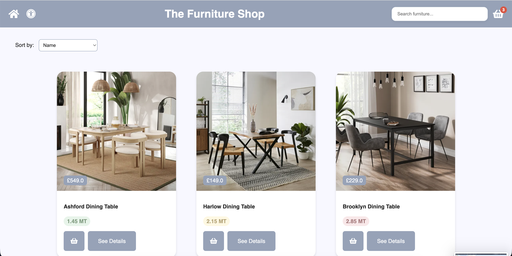
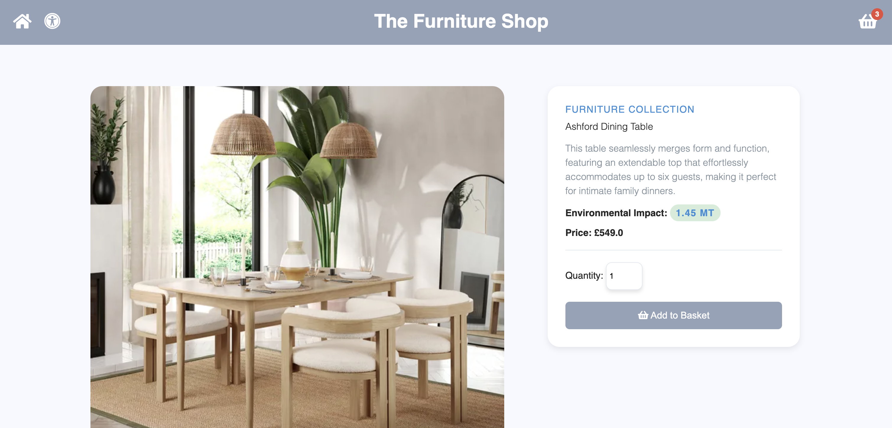
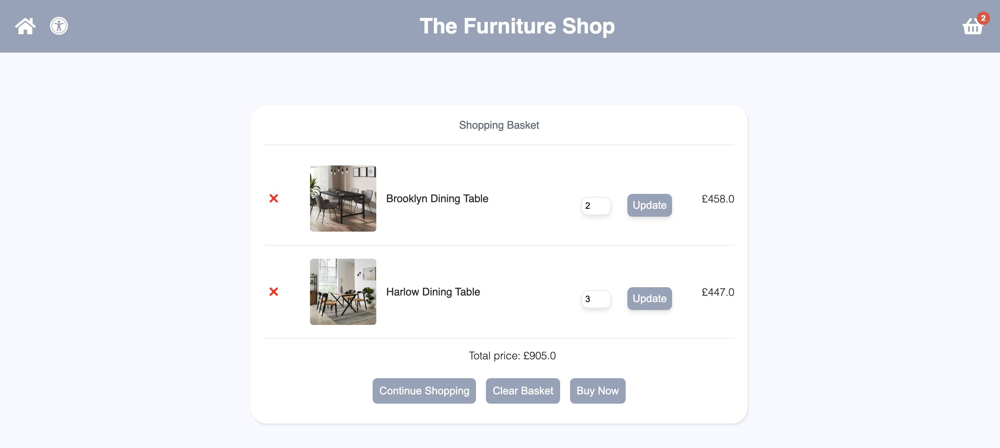
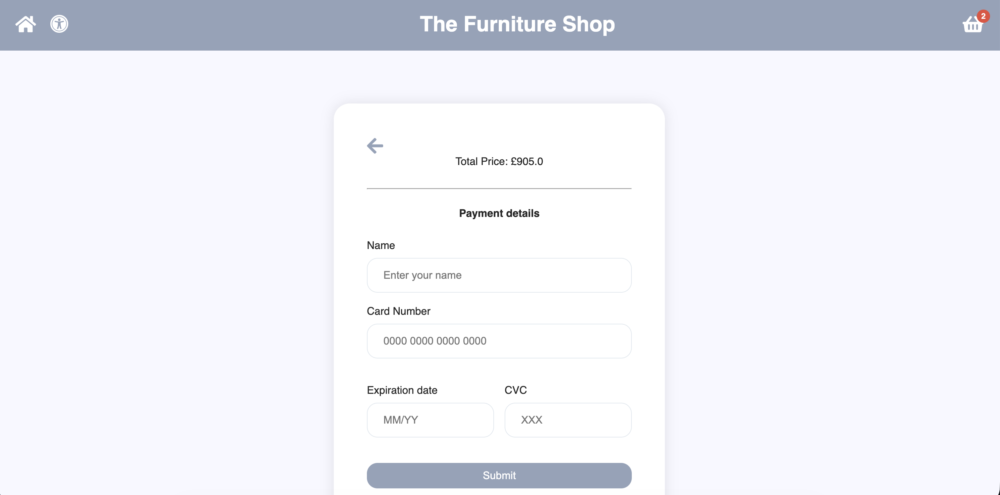
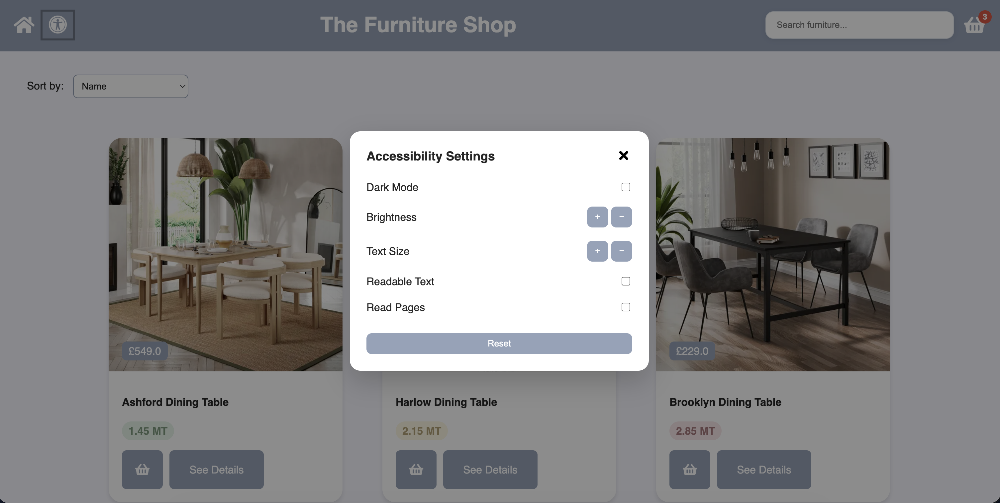
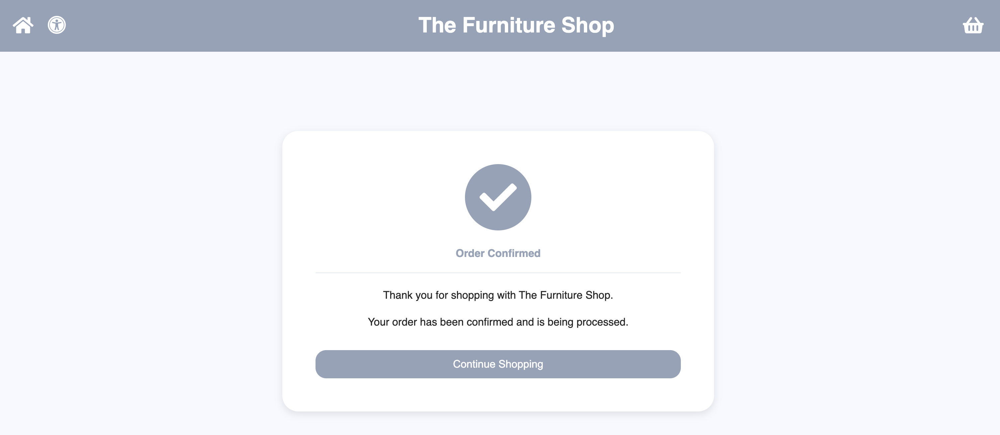

# Furniture Shop

A Flask-based furniture e-commerce web application focused on sustainable furniture shopping and accessibility features.

## Overview

The Furniture Shop is a web application that allows users to browse furniture products, view detailed product information, manage a shopping basket, and complete a checkout process.

The application also includes accessibility features such as dark mode, adjustable text size, brightness controls, dyslexia-friendly fonts, and text-to-speech support.

## Features

- Browse furniture products
- Product detail pages
- Environmental impact ratings for products
- Live search functionality
- Product sorting
- Shopping basket management
- Checkout and payment form
- Order confirmation page
- Responsive design

## Accessibility Features

- Dark mode
- Adjustable text size
- Brightness controls
- OpenDyslexic font support
- Text-to-speech functionality
- Keyboard-accessible controls

## Screenshots

### Home Page



### Product Page



### Shopping Basket



### Checkout



### Accessibility Settings



### Order Confirmation



## Requirements

- Python 3.10+
- Flask
- Flask-SQLAlchemy

## Installation

Clone the repository:

```bash
git clone https://github.com/Salmah1/flask-furniture-shop.git
cd flask-furniture-shop
```

Create a virtual environment:

```bash
python -m venv venv
```

Activate the virtual environment:

### macOS/Linux

```bash
source venv/bin/activate
```

### Windows

```bash
venv\Scripts\activate
```

Install dependencies:

```bash
pip install -r requirements.txt
```

## Running the Application

Start the Flask server:

```bash
python app.py
```

Open your browser and visit:

```text
http://127.0.0.1:5001
```

## Technologies

- Python 3
- Flask
- Flask-SQLAlchemy
- SQLite
- HTML5
- CSS3
- JavaScript
- jQuery
- Jinja2

## Project Structure

```text
flask-furniture-shop/
│
├── app/
│   ├── instance/
│   │   └── data.sqlite3
│   │
│   ├── templates/
│   │   ├── base.html
│   │   ├── index.html
│   │   ├── ProductPage.html
│   │   ├── ShoppingBasket.html
│   │   ├── PaymentPage.html
│   │   ├── PaymentSuccessfulPage.html
│   │   └── Error.html
│   │
│   ├── static/
│   │   ├── styles/
│   │   ├── js/
│   │   ├── images/
│   │   └── fonts/
│   │
│   ├── app.py
│   └── Items_DB.py
│
├── screenshots/
│
├── README.md
└── requirements.txt
```
